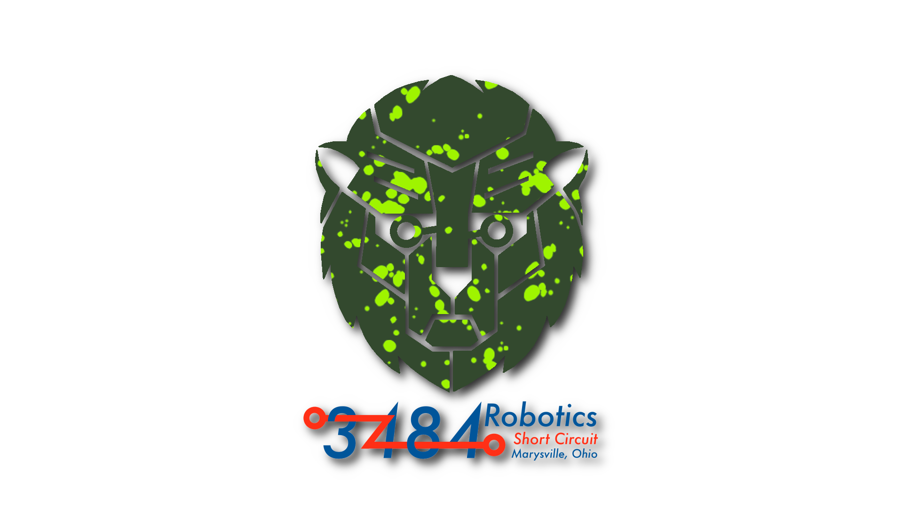

# X24_RobotCode
---
<p align="center">
    
</p>

## Installation

First, clone the repository
```
git clone https://github.com/FRC-Team3484/X24_RobotCode
```

Then, open the `2024Robot_Team3484` folder in Visual Studio Code.
Open the command pallate with `Ctrl-Shift-P` and run the `WPILib: Build Robot Code` command.

You can use `Git: Open Repository` and select the `X24_RobotCode` parent folder to enable the Git tools inside of VSCode, while still being able to build and run the code.

## NeoVim
If you wanted to use NeoVim to write code instead of Visual Studio Code, follow these steps:

Download [CMakeLists.txt](lihttps://gist.github.com/michamichaa/bc599e737ef85ee47e8b25847f9a2a3bnk) and put it into `2024Robot_Team3484`.

Inside the `2024Robot_Team3484` directory, create a directory called `out`, and run `cd out`

Run `cmake ..`

Move `compile_commands.json` from `out` to `2024Robot_Team3484/build`

You can now build the code by running the command `./gradlew build` in the `2024Robot_Team3484` directory.